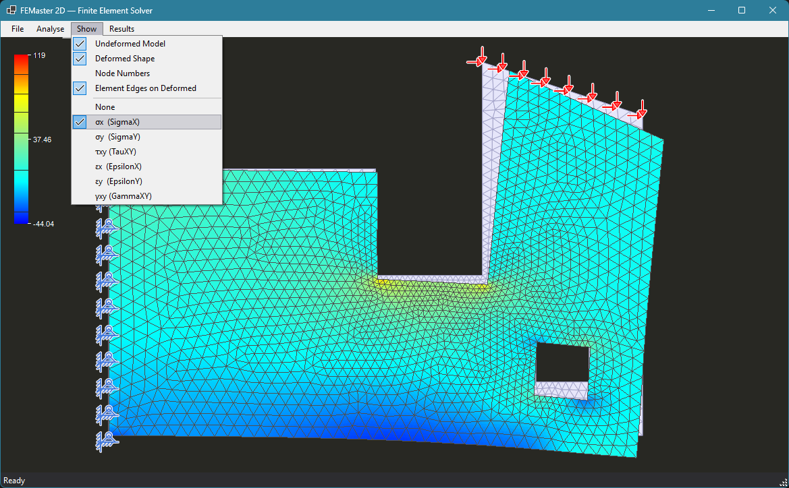

# FEMaster 2D

FEMaster 2D is a .NET finite element analysis and visualization tool for 2D constant-strain triangle models.

It is a C# port of the older btFEM Visual Basic project, rebuilt with a modern drawing layer, a faster solver path, and a cleaner WinForms UI.

## Features

- Load FEM model files with nodes, triangle elements, loads, and supports
- Run analysis with direct condensation as the primary solver path
- Visualize undeformed and deformed meshes
- Display stress and strain contours
- Inspect node numbers, loads, supports, and element selection
- Export the current viewport as an image

## Example Result

## Project Structure

- `FEMaster/FEMaster.Core` - FEM model, solver, and element math
- `FEMaster/FEMaster.Form` - WinForms UI and drawing layer

## Notes

- The legacy VB project is kept out of version control for this cleaned-up repo state.
- Temporary AI and local tooling folders are ignored.

## Build

Open `FEMaster/FEMaster.sln` in Visual Studio 2022 or build it with the .NET SDK.
